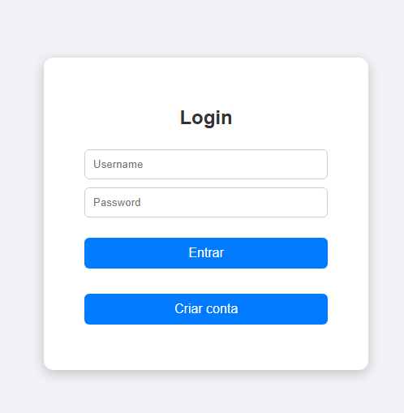
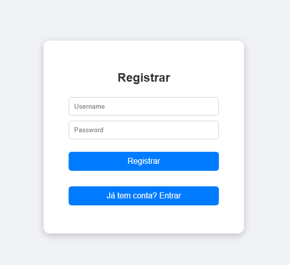

## Sistema de Usuários - Spring Boot + Frontend
Sistema de gerenciamento de usuários com autenticação via Spring Security, registro e login funcionando com MySQL, e frontend básico em HTML/JS/CSS.

---

## Funcionalidades
Cadastro de usuários (nome e senha)
Login com Spring Security
Criptografia de senhas com BCrypt
Dashboard simples após login
API REST básica para usuários
Frontend básico com páginas:
login.html
register.html
dashboard.html
Validação de login e registro via backend

---

## Tecnologias
Java 17
Spring Boot 3.2
Spring Data JPA
Spring Security
MySQL
Maven
HTML, CSS e JavaScript para frontend

---

## Endpoints da API
POST /usuarios/register – registra novo usuário
POST /usuarios/login – login de usuário
GET /usuarios/home – dashboard (apenas após login)

---

## Observações:
Senhas são criptografadas com BCrypt antes de salvar no banco
Frontend básico funciona com fetch API para se comunicar com o backend
As páginas possuem links entre login e registro para facilitar a navegação

### Tela de Login

#### Registro

#### Registro

