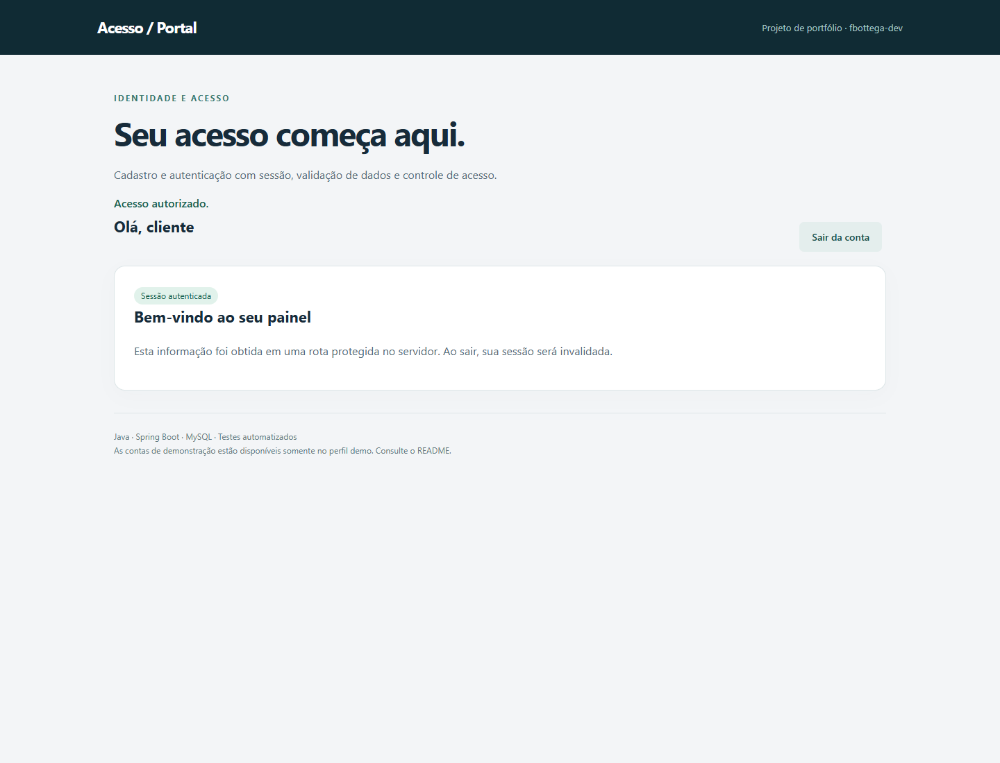

# Portal de cadastro e autenticação

[](https://github.com/fbottega-dev/sistema-cadastro-java-mysql/actions/workflows/ci.yml)

Evolução de um projeto de cadastro Java: o login agora cria uma sessão autenticada de verdade, com proteção CSRF, validação de entrada e testes de acesso ao painel.

**Stack:** Java 21 · Spring Boot 3.5 · Spring Security · JPA/Hibernate · MySQL 8.4 · Flyway · JUnit · Docker.



## Funcionalidades

- Cadastro com validação, usuário único e hash BCrypt; senha nunca é retornada pela API.
- Login com sessão HTTP, cookie HttpOnly/SameSite e logout com invalidação da sessão.
- Interface responsiva servida pela própria aplicação, sem configuração de CORS.
- Painel que consulta uma rota protegida e identifica o usuário autenticado.
- Edição do nome de exibição, mantendo o usuário de acesso, a senha e as permissões.
- Erros de validação e conflito retornados como respostas HTTP apropriadas.

## Executar em 3 minutos — sem instalar banco

Requisito: **JDK 21** configurado em JAVA_HOME. O Maven Wrapper está incluído.

No Windows (PowerShell):

```powershell
.\mvnw.cmd spring-boot:run "-Dspring-boot.run.profiles=demo" "-Dspring-boot.run.arguments=--server.port=8080"
```

No Linux/macOS:

```bash
chmod +x mvnw
./mvnw spring-boot:run -Dspring-boot.run.profiles=demo -Dspring-boot.run.arguments=--server.port=8080
```

Abra **http://localhost:8080**. O perfil demo usa H2 em memória: os dados são apagados ao encerrar.

| Usuário | Senha de demonstração | Perfil |
|---|---|---|
| cliente | Demo12345! | Cliente |
| tecnico | Demo12345! | Técnico |

Essas contas são criadas somente com o perfil demo. Não ative esse perfil em uma instalação pública.

## Executar com MySQL e Docker

```bash
cp .env.example .env
# Defina DB_PASSWORD no arquivo .env.
docker compose up --build -d
```

No PowerShell, use `Copy-Item .env.example .env` no lugar de cp. Abra http://localhost:8080 e cadastre uma conta. O banco persiste no volume do Compose; `docker compose down` mantém os dados.


As migrations criam um **banco novo**. Para reaproveitar um banco de versões antigas, faça backup e planeje a migração antes de apontar a aplicação para ele. Não há migração automática dos dados legados.

## Testes

```powershell
.\mvnw.cmd verify
```

11 testes JUnit verificam autenticação, validação do nome, isolamento entre contas, preservação das credenciais e atualização do banco V1 para V2. O banco H2 de teste é criado por Flyway. No Actions, um teste HTTP adicional sobe a aplicação em Docker com **MySQL real**, altera o nome e confirma sua persistência após um novo login.

Para executar esse teste com o Compose já ativo e Node.js 22: `node scripts/smoke.mjs`.

## API

| Método | Rota | Finalidade |
|---|---|---|
| GET | /csrf | Obter token e cookie de sessão |
| POST | /usuarios/register | Criar usuário (JSON: username, password) |
| POST | /usuarios/login | Login (form-urlencoded: username, password) |
| GET | /usuarios/me | Consultar usuário autenticado |
| PATCH | /usuarios/me | Alterar o próprio nome (JSON: displayName) |
| POST | /usuarios/logout | Invalidar sessão |


Para POST e PATCH, mantenha o cookie e envie o token no header retornado por /csrf. Obtenha novo token depois do login/logout. Consulte exemplos em [docs/API.md](docs/API.md).

No painel, **Meu perfil** permite salvar um nome de 2 a 80 caracteres. Espaços nas pontas são removidos, e acentos e espaços internos são aceitos. O nome inicial é igual ao usuário de acesso; a migration V2 também preenche esse valor nas contas já existentes no schema V1, preservando as credenciais.

O passo a passo está em [Como funciona a edição do nome](docs/PERFIL.md), com o caminho da requisição e um roteiro para testar e explicar a mudança.

## Organização e decisões

```text
controller/  HTTP, DTOs e validação
service/     regras e transações
repository/  acesso ao banco via JPA
model/       entidades persistidas
config/      segurança e dados demo
resources/db/migration/  schema versionado
resources/static/       HTML, CSS e JavaScript
```

Sessão foi escolhida porque interface e backend compartilham a mesma origem. Spring Security executa a autenticação; conferir BCrypt e retornar uma mensagem não autentica as próximas requisições.

## Limitações e próximos passos

- Projeto de portfólio para execução local; não há hospedagem pública incluída.
- Sem recuperação de senha, verificação de e-mail ou limitação de tentativas de login.
- Senhas aceitam de 8 a 64 caracteres ASCII para respeitar o limite de bytes do BCrypt.
- Para exposição pública: HTTPS, cookie Secure, proteção contra força bruta e gestão de segredos.
- A edição do perfil se limita ao nome de exibição; não há administração de usuários ou histórico dos nomes anteriores.

[Requisitos e evolução](docs/ROADMAP.md) · [Uso de IA e revisão](docs/AI_USAGE.md)
